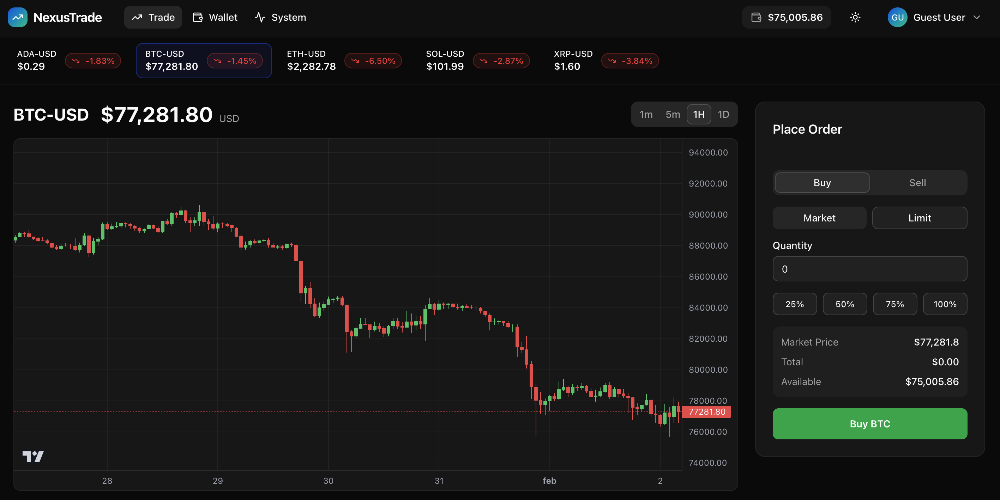
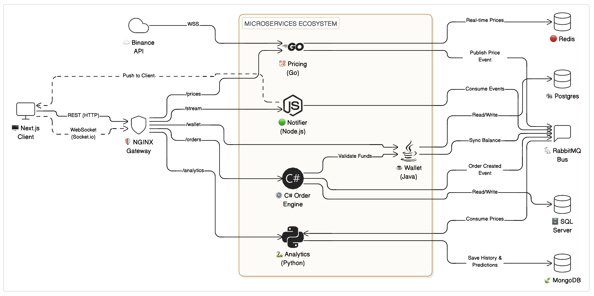

# Nexus Trade Platform 🚀

**A High-Performance, Polyglot Trading Simulation Platform.**

Nexus Trade is an enterprise-grade ecosystem of microservices designed to simulate a real-time Digital Asset Exchange. It demonstrates advanced distributed system concepts including **Event-Driven Architecture**, **CQRS**, **Hexagonal Architecture**, and **Real-Time WebSockets**.

---

### 🔗 Live Demo & Recruiter Access

The platform is fully deployed and ready for review. You can access the live dashboard and explore the system's capabilities without local setup.

**🌐 [NEXUS TRADE APP](https://nexus.alejandroastudillo.dev/)**

> **👋 For Recruiters & Technical Reviewers:**
> You don't need to register! On the login screen, simply click the **"🚀 Try Demo Account"** button. This will instantly grant you access to a pre-funded portfolio with **$100,000 USD** in simulated funds to test real-time trading and analytics.

---

### 📸 System Visualization

*(High-level overview of the microservices, message brokers, and persistence layers)*

---

### 🏗️ Technical Architecture

This platform is built as a distributed system where each service is implemented using the most efficient technology for its specific responsibility:

| Service | Technology | Pattern |
| :--- | :--- | :--- |
| **Pricing Engine** | **Go (Golang)** | High-frequency ingestion & Fan-out |
| **Order Engine** | **C# (.NET)** | CQRS & Transactional Logic |
| **Wallet Core** | **Java (Spring Boot)** | Hexagonal Architecture & Ledger |
| **Analytics** | **Python (FastAPI)** | ML Risk Prediction & Data Science |
| **Notifier** | **Node.js (NestJS)** | Event-Driven WebSocket Gateway |
| **Frontend** | **Next.js** | Server Components & Real-time UI |

---

### ⚡ Engineering Highlights

*   **Low-Latency Market Data:** Real-time prices flow from Go to the Frontend via WebSockets, optimized for sub-millisecond internal processing.
*   **Asynchronous Consistency:** Using **RabbitMQ**, the system ensures that a filled order in the C# engine correctly updates the User's Wallet in Java and triggers a notification in Node.js without blocking the main execution thread.
*   **Polyglot Persistence:** Utilizing the best tool for the job: **PostgreSQL** for financial consistency, **MongoDB** for analytical history, **Redis** for real-time caching, and **SQL Server** for high-volume order logging.
*   **Security:** Centralized authentication via JWT, managed at the API Gateway level and propagated across all internal services.

---

### 📂 Repository Overview

This repository serves as the **Documentation and Design Hub** for the project. For security and intellectual property reasons, the source code is kept in a private production environment, but the architecture and API contracts are fully documented here.

*   **API Specifications:** OpenAPI 3.0 definitions for all services are available in the `contracts/` folder within each of the services.

---

### 📚 API Documentation

You can explore the interface contracts for each microservice:
*   **Wallet Service:** Managed in Java, handles balances and identity.
*   **Order Service:** Managed in C#, handles the logic of market/limit orders.
*   **Pricing Service:** Managed in Go, handles external API connections.

### 📝 Author & Purpose

Created by **Alejandro Astudillo** as a professional portfolio project to demonstrate proficiency in **System Design, Microservices, and Cloud-Native Development**.

*   **LinkedIn:** [My LinkeDin](https://www.linkedin.com/in/alejandro-astudillo-584a071b5/)
*   **Portfolio:** [My Portfolio](https://alejandroastudillo.dev/)
